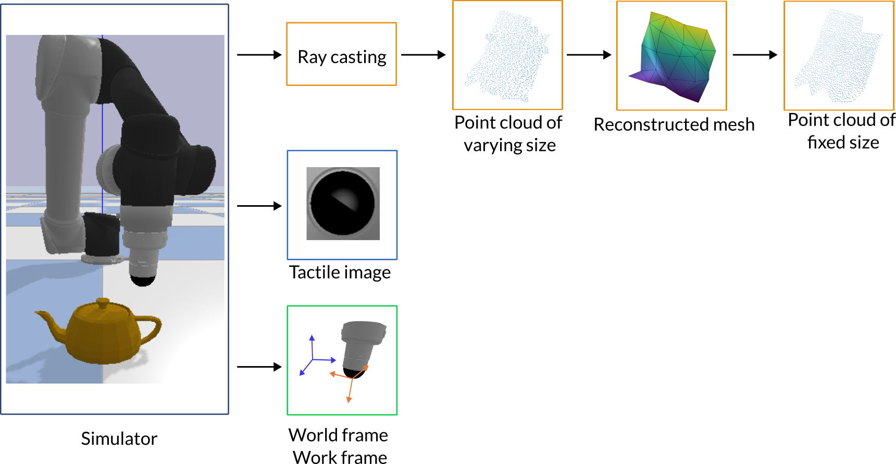
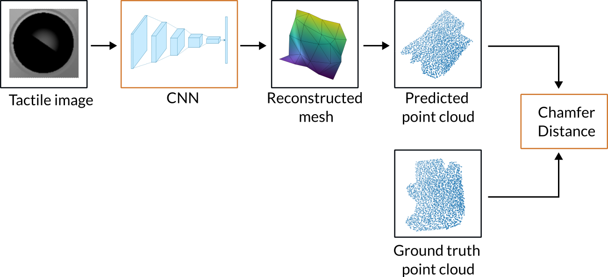
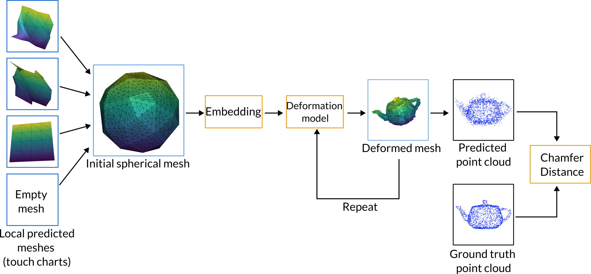

# Shape Reconstruction using Optical Tactile Sensing
This repository provides an adaptation of the approach proposed in [Active 3D Shape Reconstruction using Vision and Touch](https://github.com/facebookresearch/Active-3D-Vision-and-Touch). The original paper describes a method to reconstruct 3D shapes from the interaction between a robot and a set of 3D shapes. In this repository, we adapted this technique to the vision-based tactile sensor [TacTip](https://www.liebertpub.com/doi/10.1089/soro.2017.0052).

We used the open-source robot learning library [Tactile-Gym](https://github.com/ac-93/tactile_gym) to control the robot and collect data for shape reconstruction. Tactile-Gym is based on the physical simulator PyBullet, and provides a suite of learning environments for highly-efficient tactile image rendering.

If you find this code useful, please consider citing the following in your BibTex entry:
```
@misc{comi2022active,
author = {Mauro Comi},
title = {{3D Shape Reconstruction using Optical Tactile Sensing}},
howpublished = {\url{https://github.com/maurock/object_reconstruction}},
year = {2022}
}

@article{smith2021active,
  title={Active 3D Shape Reconstruction from Vision and Touch},
  author={Smith, Edward J and Meger, David and Pineda, Luis and Calandra, Roberto and Malik, Jitendra and Romero, Adriana and Drozdzal, Michal},
  journal={arXiv preprint arXiv:2107.09584},
  year={2021}
}
```

If you are using the Tactile-Gym library, please refer to [the source website](https://github.com/ac-93/tactile_gym) for citation. 
# Content
- [Installation](#installation)
- [Data making](#data-making)
- [Touch prediction](#touch-prediction)
- [Deformation prediction](#deformation-prediction)
- [Known issues](#known-issues)
# Installation
This repository was developed using Pyton=3.8. It was tested on macOS Monterey M1 (tested on CPU, but it can run on a GPU), Ubuntu 20.04 (GPU), and CentOS 7 (GPU). Some python libraries vary slightly depending on the OS you are using. Later in this README, I provide OS-dependent installation instructions for those libraries. 

To clone this repository, install it, and create a new environment:
```
conda create -n optical_reconstruction python=3.8
conda activate optical_reconstruction
git clone https://github.com/maurock/object_reconstruction.git
cd object_reconstruction
pip install -e .
```
To create the directories needed to collect data and run tests, run
```
bash create_directories.sh
```
In addition, you need to install the `Tactile-Gym` library (branch `active_reconstruction`):
```
pip install "git+https://github.com/ac-93/tactile_gym.git@active_reconstruction#egg=tactile_gym"
cd src/tactile-gym
python setup.py install
```
Additional libraries required:
```
conda install plotly scikit-learn==1.0.2 -c conda-forge
pip install open3d==0.15.1 pyrsistent==0.18.1 trimesh==3.10.2
```
### On macOS (CPU)
On macOS, this repository uses Python 3.8, PyTorch 1.9 (CPU, but GPU should also work), PyTorch3D 0.7 (CPU-only). 
```
pip install "git+https://github.com/facebookresearch/pytorch3d.git"
```
### On Ubuntu (GPU)
Pytorch3D supports CUDA on Ubuntu
```
FORCE_CUDA=1 conda install pytorch3d -c pytorch3d -c anaconda -c pytorchconda install -c fvcore -c iopath -c conda-forge fvcore iopath
```
This should install PyTorch with CUDA enabled. If it does not, please make sure to install it. 

# Data making
## Dataset
The 3D objects we used are .URDF files from the [PartNet-Mobility Dataset](https://sapien.ucsd.edu/downloads). To download the objects, please follow the instructions on their website. 

The folders that you download from the PartNet website (e.g. `3398`, `3517`) need to be stored in `object_reconstruction\data\objects`:
```
root
 ├── object_reconstruction
 │   ├── data
 │   │   ├── objects
 │   │   │   ├── 3398 # your obj file here  
 │   │   │   ├── 3517 # your obj file here  
```
## Touch charts data collection
<p align="center">
  
</p>

To generate data for the touch chart prediction model:
```
python data_making/extract_touch_charts.py
```
This generates touch charts in `data/touch_charts/<object_id>/touch_charts_gt.npy`. On macOS, data collection does not work for PyBullet DIRECT mode, but only for PyBullet GUI mode. Therefore, if you are on macOS please run 
```
python data_making/extract_touch_charts.py --show_gui
```
## Data collection for deformation model
To generate the full deformation model:
```
python data_making/extract_deformation.py
```
This generates data in `data/touch_charts/<object_id>/touch_vision.npy`

## Object pointcloud data collection
To generate the full object pointcloud, necessary to train the deformation model:
```
python data_making/extract_obj_pointcloud.py
```
This generates data in `data/obj_pointcloud/<object_id>/obj_pointcloud.npy`

# Touch prediction
<p align="center">
  
</p>

The touch prediction model predicts the shape of the local surface where the touch occurs from a vision-based tactile image. The model is based on [Active 3D Shape Reconstruction using Vision and Touch](https://github.com/facebookresearch/Active-3D-Vision-and-Touch) and adapted to the TacTip sensor and the Tactile-Gym library. The model is trained as:
```
python touch/train.py
```

# Deformation prediction
<p align="center">
  
</p>

The deformation prediction model predicts the entire shape of the object from a random number of tactile images sampled on the object surface. The model is based on [Active 3D Shape Reconstruction using Vision and Touch](https://github.com/facebookresearch/Active-3D-Vision-and-Touch) and adapted to the TacTip sensor and the Tactile-Gym library. The model is trained as:
```
python deformation/train.py
```

# Known issues
- Touch charts data collection on macOS does not work on PyBullet DIRECT mode, but only on GUI mode. Therefore, please run `python data_making/extract_touch_charts.py --show_gui`. The issue consists in the wrong baseline image for the tactile image. It will be fixed soon.
- When collecting touch charts on macOS, the simulator sometimes stops rendering the robot and/or the object. For this reason, it is recommended to collect data on Linux. 

